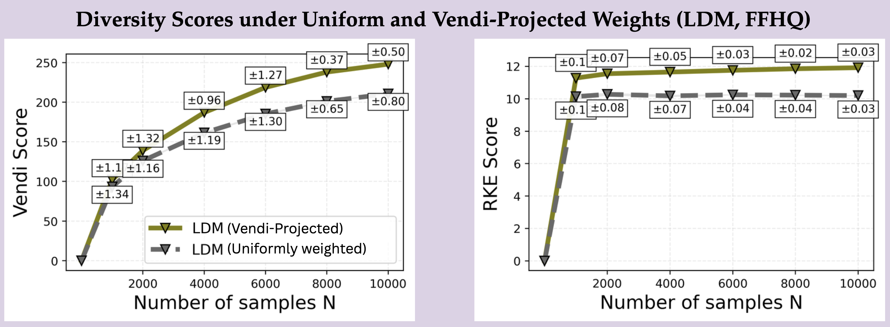
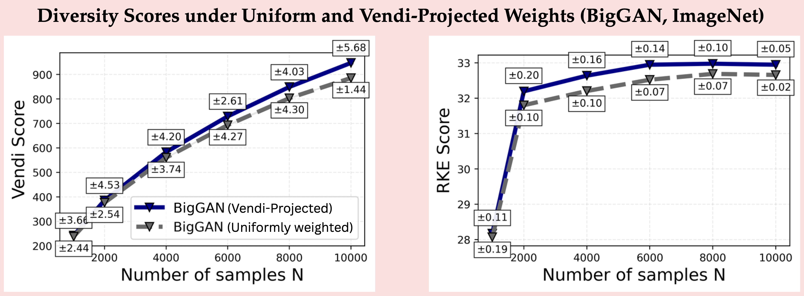
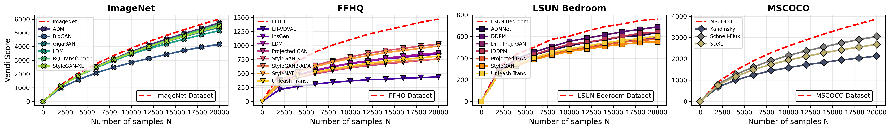
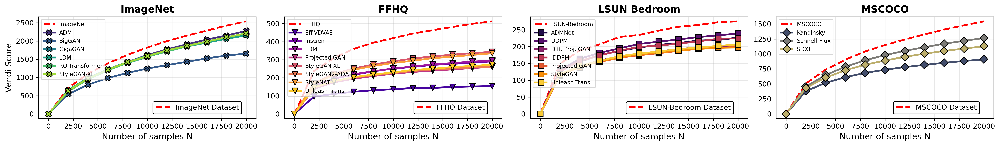
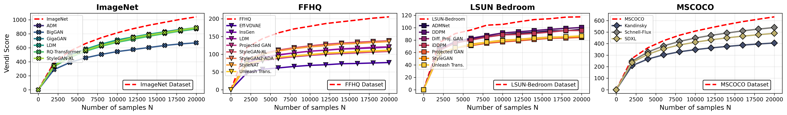
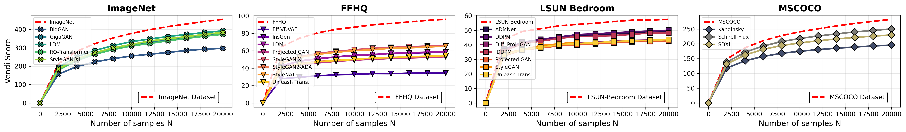

## Exposing Diversity Biases in Deep Generative Models: Towards Measuring and Correcting Diversity Error via Vendi Score

---

**Table 1:** Diversity (Vendi, RKE) and fidelity (KD, FD) scores for uniformly weighted generated samples versus their post-hoc Vendi-projected reweighting on the FFHQ dataset. Across various pre-trained generative models, the Vendi-based projection consistently yields higher diversity scores and improved fidelity for the reweighted empirical distribution.

| Model | Sampling | Vendi ↑ | RKE ↑ | KD ↓ | FD ↓ |
|-------|----------|---------|-------|------|------|
| ProjectedGAN | Uniform | 221.95 | 7.76 | 2.047 | 593.89 |
| ProjectedGAN | Projected-Vendi | 325.72 | 10.40 | 1.53 | 522.66 |
| LDM | Uniform | 210.32 | 10.21 | 0.587 | 223.32 |
| LDM | Projected-Vendi | 248.01 | 11.92 | 0.462 | 213.87 |
| VDVAE | Uniform | 198.23 | 9.73 | 1.593 | 514.16 |
| VDVAE | Projected-Vendi | 243.93 | 11.24 | 1.293 | 213.87 |
| StyleGAN-2 | Uniform | 204.95 | 10.18 | 0.7134 | 239.73 |
| StyleGAN-2 | Projected-Vendi | 223.94 | 11.29 | 0.638 | 227.03 |
| InsGen | Uniform | 291.05 | 9.28 | 1.332 | 437.51 |
| InsGen | Projected-Vendi | 376.72 | 11.48 | 1.066 | 409.24 |
| Unleas-Trans | Uniform | 323.10 | 9.35 | 1.041 | 394.97 |
| Unleas-Trans | Projected-Vendi | 394.61 | 11.64 | 0.934 | 376.83 |

---

**Table 2:** Diversity (Vendi, RKE) and fidelity (KD, FD) scores for uniformly weighted generated samples versus their post-hoc Vendi-projected reweighting on the ImageNet dataset. Across various pre-trained generative models, the Vendi-based projection consistently yields higher diversity scores and improved fidelity for the reweighted empirical distribution.

| Model | Sampling | Vendi ↑ | RKE ↑ | KD ↓ | FD ↓ |
|-------|----------|---------|-------|------|------|
| BigGAN | Uniform | 885.68 | 32.56 | 0.539 | 403.57 |
| BigGAN | Projected-Vendi | 947.32 | 33.27 | 0.517 | 386.34 |
| LDM | Uniform | 889.44 | 33.83 | 0.102 | 124.31 |
| LDM | Projected-Vendi | 919.18 | 34.89 | 0.094 | 105.95 |
| StyleGAN-XL       | Uniform | 873.38 | 33.82 | 0.236 | 214.82 |
| StyleGAN-XL | Projected-Vendi | 919.18 | 34.27 | 0.189 | 198.37 |
| GigaGAN | Uniform | 886.93 | 33.63 | 0.248 | 228.35 |
| GigaGAN | Projected-Vendi | 934.75 | 34.25 | 0.213 | 207.64 |

---

**Figure 1:** Vendi and RKE diversity scores vs. size N for N uniformly weighted generated samples and
their post-hoc Vendi-projected reweighting LDM trained on FFHQ. The Vendi-based projection yields higher diversity scores for the reweighted empirical distribution.

**Figure 2:** Vendi and RKE diversity scores vs. size N for N uniformly weighted generated samples and
their post-hoc Vendi-projected reweighting LDM trained on ImageNet. The Vendi-based projection yields higher diversity scores for the reweighted empirical distribution.

---

**Figure 3a:** Comparison of Vendi scores of the test sample set (the dashed red curve) and the generated samples
by pre-trained generative models across four datasets. The backbone embedding is DINOv2 embeddings
using Gaussian (RBF) kernel with bandwidth $\sigma=30$.

**Figure 3b:** Comparison of Vendi scores of the test sample set (the dashed red curve) and the generated samples
by pre-trained generative models across four datasets. The backbone embedding is DINOv2 embeddings
using Gaussian (RBF) kernel with bandwidth $\sigma=35$.

**Figure 3c:** Comparison of Vendi scores of the test sample set (the dashed red curve) and the generated samples
by pre-trained generative models across four datasets. The backbone embedding is DINOv2 embeddings
using Gaussian (RBF) kernel with bandwidth $\sigma=40$.

**Figure 3d:** Comparison of Vendi scores of the test sample set (the dashed red curve) and the generated samples
by pre-trained generative models across four datasets. The backbone embedding is DINOv2 embeddings
using Gaussian (RBF) kernel with bandwidth $\sigma=45$.

